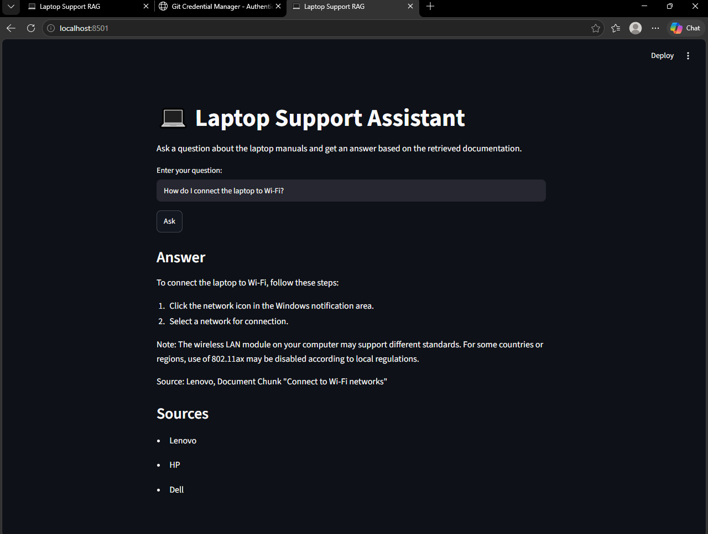

# Laptop Support RAG Assistant

A Retrieval-Augmented Generation (RAG) application that answers laptop support questions using information retrieved from official laptop manuals.

The project implements a complete RAG pipeline:

1. Load and inspect laptop manuals.
2. Split documents into overlapping chunks.
3. Generate embeddings using Sentence Transformers.
4. Store and retrieve document chunks using ChromaDB.
5. Build a grounded prompt from retrieved context.
6. Generate answers using a local Ollama LLM.
7. Serve the RAG pipeline through a FastAPI backend.
8. Provide a Streamlit frontend for user interaction.

The project follows the Core Track of the graduation project and focuses on text-based document question answering.

---

## Architecture

```text
Laptop Manuals
      |
      v
PDF Text Parsing
      |
      v
Chunking
1000 chars / 200 overlap
      |
      v
Embeddings
all-MiniLM-L6-v2
      |
      v
ChromaDB
Persistent Vector Store
      |
      v
Retrieve Top 5 Chunks
      |
      v
Grounded Prompt
      |
      v
Ollama LLM
llama3.2:3b
      |
      v
Answer + Sources
```

### End-to-End Application Flow

```text
User Question
      |
      v
Streamlit Frontend
      |
      v
FastAPI /query
      |
      v
Question Embedding
      |
      v
ChromaDB Retrieval
      |
      v
Top-5 Relevant Chunks
      |
      v
Grounded Prompt
      |
      v
Local Ollama LLM
      |
      v
Answer + Sources
      |
      v
Streamlit UI
```

---

## Project Structure

Laptop_Support_RAG/
|
|-- README.md
|-- .gitignore
|-- rag_config.json
|
|-- notebooks/
|   |-- rag_pipeline.ipynb
|   |-- chroma_db/
|       |-- chroma.sqlite3
|       |-- ...
|
|-- backend/
|   |-- app/
|   |   |-- main.py
|   |   |-- api/
|   |   |   |-- routes/
|   |   |       |-- query.py
|   |   |-- core/
|   |   |   |-- config.py
|   |   |-- schemas/
|   |   |   |-- query.py
|   |   |-- services/
|   |   |   |-- retrieval.py
|   |   |   |-- generation.py
|   |   |-- utils/
|   |       |-- logging_config.py
|   |
|   |-- data/
|   |   |-- vector_store/
|   |
|   |-- tests/
|   |   |-- test_query.py
|   |
|   |-- requirements.txt
|   |-- .env.example
|   |-- Dockerfile
|
|-- frontend/
|   |-- app.py
|   |-- api_client.py
|   |-- requirements.txt
|   |-- .env
|
|-- data/
    |-- pdfs/


---

## Tech Stack

| Component | Technology |
|---|---|
| Programming Language | Python |
| Notebook | Jupyter Notebook |
| PDF Parsing | pypdf |
| Embeddings | Sentence Transformers |
| Embedding Model | all-MiniLM-L6-v2 |
| Vector Database | ChromaDB |
| LLM Runtime | Ollama |
| LLM Model | llama3.2:3b |
| Backend | FastAPI |
| Frontend | Streamlit |
| API Client | requests |
| Testing | pytest / FastAPI TestClient |
| Version Control | Git / GitHub |


---

## Domain and Data

### Domain

The selected domain is **Laptop Support and Laptop Manuals**.

The RAG assistant answers questions using information retrieved from laptop user manuals.

### Source Documents

The project uses three English laptop manuals:

1. **Dell Latitude 5540 Owner's Manual**
2. **Lenovo LOQ User Guide**
3. **HP User Guide**

The three documents contain a total of **291 pages**.

The documents were parsed using `pypdf` and did not require OCR.

The manuals contain information about topics such as:

- Battery replacement
- Charging
- Wi-Fi
- Bluetooth
- External displays
- BIOS
- Power troubleshooting
- Cleaning
- Recovery and reset
- Hardware components


---

## RAG Pipeline

### Chunking

The documents are split using fixed-size character chunks.

- Chunk size: 1000 characters
- Chunk overlap: 200 characters

The overlap helps preserve context between neighboring chunks.

The resulting dataset contains **582 chunks**.

### Embeddings

Embeddings are generated using:

`all-MiniLM-L6-v2`

The embeddings are stored in ChromaDB.

### Vector Store

The ChromaDB collection is:

`laptop_manuals`

The vector store contains the embedded document chunks and is persisted for reuse.


---

### Retrieval

For each user question, the system:

1. Converts the question into an embedding.
2. Searches ChromaDB for similar document chunks.
3. Retrieves the top 5 relevant chunks.
4. Builds a context from the retrieved chunks.
5. Sends the context and the question to the local Ollama model.

### Generation

The project uses the local Ollama model:

`llama3.2:3b`

The prompt instructs the model to:

- Use only the retrieved document context.
- Avoid outside knowledge.
- Avoid inventing information.
- State when the requested information is not available.
- Provide numbered steps when appropriate.
- Mention the source document used.


---

## Backend Setup

### Requirements

The backend requires Python 3.10 or later and Ollama.

Check Python:

```powershell
python --version
```

Check Ollama:

```powershell
ollama --version
```

Download the required model:

```powershell
ollama pull llama3.2:3b
```

### Create Virtual Environment

From the project root:

```powershell
python -m venv .venv
```

Activate it:

```powershell
.venv\Scripts\activate
```

Install the backend dependencies:

```powershell
pip install -r backend/requirements.txt
```


### Environment Variables

Create:

`backend/.env`

Use the following configuration:

| Variable | Example |
|---|---|
| OLLAMA_MODEL | llama3.2:3b |
| VECTOR_STORE_PATH | data/vector_store |
| COLLECTION_NAME | laptop_manuals |
| EMBEDDING_MODEL | all-MiniLM-L6-v2 |
| TOP_K | 5 |

No API key is required because the LLM runs locally through Ollama.


### Start Backend

Open a terminal in the project root and run:

```powershell
cd backend
```

Then start the FastAPI server:

```powershell
uvicorn app.main:app --reload
```

The backend will be available at: http://localhost:8000

FastAPI Swagger documentation: http://localhost:8000/docs

Health check: http://localhost:8000/health


---

## Frontend Setup

Open another terminal and activate the virtual environment:

```powershell
.venv\Scripts\activate
```

Install the frontend dependencies:

```powershell
pip install -r frontend/requirements.txt
```

Create:

`frontend/.env`

Add:

```
API_BASE_URL=http://localhost:8000
```

Start the Streamlit application:

```powershell
cd frontend
streamlit run app.py
```

The frontend will normally be available at:

http://localhost:8501


---

## API Reference

### GET /health

Checks whether the backend is running.

```powershell
curl http://localhost:8000/health
```

Expected response:

```json
{
  "status": "ok"
}
```

### POST /query

Sends a laptop support question to the RAG pipeline.

Request:

```json
{
  "question": "How do I charge the laptop?"
}
```

Response:

```json
{
  "answer": "Answer generated from the retrieved laptop manual context.",
  "sources": [
    "HP"
  ]
}
```


---

## Testing

The backend includes two tests:

1. Happy-path query.
2. Invalid input validation.

Run:

```powershell
cd backend
pytest
```

Expected result:

```
2 passed
```

The invalid input test verifies that a request without the required question field returns HTTP 422.

---

## Evaluation

The RAG pipeline was evaluated using 10 test questions.

The evaluation checked:

- Retrieval relevance.
- Answer grounding.
- Failure cases and limitations.

### Evaluation Summary

| Metric | Result |
|---|---:|
| Total questions | 10 |
| Retrieval relevant | 7 |
| Retrieval partial | 3 |
| Answers grounded | 8 |
| Answers partial | 2 |


### Evaluation Questions

| # | Question | Retrieval | Grounding |
|---:|---|---|---|
| 1 | How do I replace the battery? | Yes | Yes |
| 2 | How do I connect to a Wi-Fi network? | Yes | Yes |
| 3 | How do I turn on Bluetooth? | Partial | Yes |
| 4 | How do I charge the laptop? | Yes | Yes |
| 5 | How do I connect an external monitor? | Yes | Yes |
| 6 | How do I troubleshoot power problems? | Partial | Partial |
| 7 | How do I update the BIOS? | Partial | Partial |
| 8 | How do I clean the laptop? | Yes | Yes |
| 9 | How do I recover or reset the laptop? | Yes | Yes |
| 10 | How do I install or remove a component? | Yes | Yes |


### Failure Cases and Limitations

Some questions produced partially relevant retrieval results.

For example, the power troubleshooting question retrieved a mixture of general power information and a Dell Wi-Fi power-cycle procedure.

The BIOS question also retrieved multiple BIOS-related procedures, which made the retrieved context less focused.

These cases show that retrieval quality can vary depending on the wording of the question and the similarity between related manual sections.

The system uses top-5 retrieval to provide more context.

The prompt also restricts the LLM to the retrieved document context and instructs it not to invent information.


 ---

## Persisted Vector Store

The project uses a persisted ChromaDB vector store.

- Collection: `laptop_manuals`
- Number of chunks: 582
- Embedding model: `all-MiniLM-L6-v2`

The vector store is persisted so that the backend can load the existing embeddings without rebuilding the entire vector database every time.

The main RAG configuration is stored in:

`rag_config.json`


---

## Screenshots

Screenshots of the running application can be added here to demonstrate the end-to-end system.

### Frontend




---

## End-to-End Flow

```text
User Question
      |
      v
Streamlit Frontend
      |
      v
FastAPI Backend
      |
      v
Question Embedding
      |
      v
ChromaDB Retrieval
      |
      v
Top-5 Relevant Chunks
      |
      v
Grounded Prompt
      |
      v
Local Ollama LLM
      |
      v
Answer + Sources
      |
      v
Streamlit UI
```


---

## Core Track

This project implements the text-based Core Track.

The Extended Track computer vision / YOLO component is not included.

---

## License

This project was created as an individual graduation project for educational purposes.


